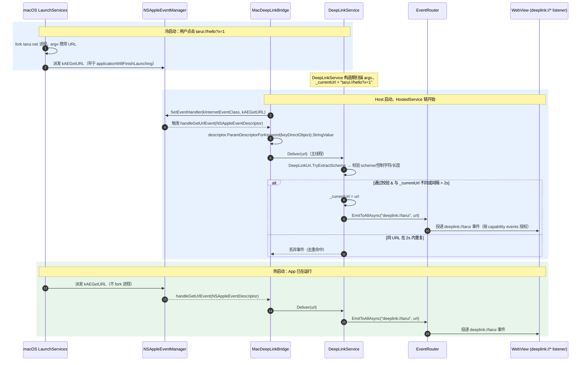

# ADR-0001：macOS DeepLink 通过 NSAppleEventManager 桥接 DeepLinkService

> 状态：已落地（待 Phase 6 macOS 真机验收）
> 日期：2026-09-19
> 决策者：Tarui 桌面壳层维护者
> 影响模块：`Tarui.Shell/DeepLinkService`、`DeepLinkRegistrarHostedService`、新文件 `Tarui.Shell/MacDeepLinkBridge.cs`、`Tarui.Shell/MacDeepLinkUrlExtractor.cs`、`examples/demo/Demo.Desktop`、`tests/Tarui.DeepLink.Tests`

## 1. 背景与问题

Tauri 桌面壳层需要支持 macOS 上自定义 URL Scheme（`tarui://...`）的 cold/warm 激活。对标框架（Tauri v2、Wails v3）的 macOS 实现均依赖 AppKit 的 `application(_:openURLs:)` 委托或更底层的 Apple Event `kAEGetURL` 通道；它们**不**走 `argv`，因为 macOS 的 `LaunchServices` 在 App 已运行时把 URL 直接发给已运行实例的 `NSApplication`，不再 fork 新进程。

Tarui 现有接线（截至 2026-09-19）：

- `DeepLinkService.Deliver(string url)` 是 macOS delegate 桥的统一入口（已存在 + 单测覆盖）；cold argv 路径走构造器 `startupArgs`。
- `WindowsDeepLinkRegistrar` / `LinuxDeepLinkRegistrar` 通过 `DeepLinkRegistrarHostedService` 在 `StartAsync` 触发平台注册。
- macOS 注册是**打包期**动作（`Info.plist` 的 `CFBundleURLTypes`），运行时不需要 `LSSetDefaultHandlerForURLScheme`。
- 但 **AppKit → 托管代码的桥目前不存在**：warm 期收到 `application:openURLs:` 时，没有代码把 URL 转给 `DeepLinkService.Deliver`，导致 macOS 上 deep-link warm 投递完全失效。

设计稿 `docs/tauri-desktop-alignment-plan.md §10.3`（2026-08-22 验收条目）已要求：

> 在 Cocoa AppDelegate 中把 `openURLs` 的 URL 交给现有 `DeepLinkService`（此类已暴露 `Deliver`，且实现 `ISecondActivationSink`，勿新增第二个 URL 入口）。

本 ADR 决定：

1. 在 `Tarui.Shell` 内增加 macOS AppleEvent 桥；
2. 桥使用 `NSAppleEventManager`（低层、跨 NSApplicationDelegate 实现）而非自定义 `NSApplicationDelegate`；
3. bridge 注册到 `DeepLinkRegistrarHostedService`，与 Windows/Linux registrar 同生命周期；
4. cold argv 与 AppleEvent 同帧重复时做去重，避免 macOS `LaunchServices` + `argv` 双路径重复投递；
5. 不引入运行时反射/动态加载；不引入 Cocoa 绑定之外的依赖（保持 `net10.0` BCL 与 `Avalonia.Desktop` 内置绑定）。

## 2. 备选方案

### 方案 A — 自定义 `NSApplicationDelegate` 并覆写 `application:openURLs:`

- **做法**：从 `Avalonia.Native.AvaloniaAppDelegate`（或 `NSApplicationDelegate`）派生，子类化 `openURLs:`，把 URL 调入 `DeepLinkService.Deliver`。
- **优点**：与 Cocoa 主线 API 对齐。
- **缺点**：
  1. Avalonia 12 已自带 `AvaloniaAppDelegate`，覆写会与宿主框架冲突；要么整体替换 delegate（破坏 Avalonia 的输入/焦点处理），要么保留原 delegate 后 hook（需要反射 KVO，违反架构约束）。
  2. cold 期 `applicationWillFinishLaunching` 之前的 AppleEvent 仍需依赖 `NSAppleEventManager`，与方案 B 重合。
  3. macOS cold 双路径（argv + AppleEvent）去重责任分散。

### 方案 B — 注册 `NSAppleEventManager` 的 `kAEGetURL` 处理函数（采用）

- **做法**：`NSAppleEventManager.SharedAppleEventManager.SetEventHandler(...)` 安装 `AEEventHandler`；handler 把 `NSAppleEventDescriptor` 解析为 URL，调 `DeepLinkService.Deliver`。
- **优点**：
  1. 与 `NSApplicationDelegate` 解耦，不影响 UI 线程与 Avalonia 主循环；
  2. cold 期也能捕获（`NSAppleEventManager` 在 `applicationWillFinishLaunching` 之前已生效）；
  3. 安装时机即"启动期"，与 `DeepLinkRegistrarHostedService.StartAsync` 自然对齐；
  4. 单一桥点做去重，warm/cold 都走 `Deliver`。
- **缺点**：
  1. handler 签名是 `NSObject + Selector`，需要把 `DeepLinkService` 引用捕获到一个 `NSObject` 子类的构造参数（与 Avalonia/Cocoa 的 NSObject 集成一致）；
  2. 桥的语义"已注册即不可重入"：多次启动同一进程会重复 `SetEventHandler`（最后写胜出，与 `NSAppleEventManager` 文档语义一致）；
  3. AppleEvent 回调必须在主线程触发 `Deliver`（[Apple 文档](https://developer.apple.com/documentation/foundation/nsappleeventmanager)），需用 `MainThread.InvokeOnMainThread` 串行化。

### 方案 C — 改用 `LSSetDefaultHandlerForURLScheme` 运行时注册并自管路由

- **做法**：运行时注册为 default handler，用 `NSWorkspace` 监听 `openURLs:` 通知，自管 URL 队列。
- **缺点**：注册是打包期责任；自管 URL 队列重复 `DeepLinkService` 已有的事件投递。无收益。

## 3. 决策

采用 **方案 B（NSAppleEventManager 桥）**：

- 单桥点：`MacDeepLinkBridge`（`src/desktop/Tarui.Shell/MacDeepLinkBridge.cs`），注册 `kAEGetURL` 处理函数。
- 注入 `DeepLinkService` 实例作为构造参数（不是从 DI 解析，因为 AppleEvent 回调无法注入 IServiceProvider）。
- 安装时机：`DeepLinkRegistrarHostedService.StartAsync` 在 Windows/Linux registrar 之后。
- 去重：`DeepLinkService` 内部记录 `_lastDeliveredUrl` 与 `_lastDeliveredAt`，相同 URL 在 2s 内不再 emit `deeplink://<scheme>` 事件（cold argv + AppleEvent 同帧典型场景），但 `_currentUrl` 仍被覆写。
- 平台隔离：`MacDeepLinkBridge` 标记 `[SupportedOSPlatform("macos")]`；非 macOS 容器注册 `NoOpMacDeepLinkBridge`，`StartAsync` 立即返回。
- 测试：新增 `MacBridgeDeliversToServiceAsync`（Windows 环境 `Skip`）覆盖 fake `NSAppleEventDescriptor` → `Deliver` → `deeplink://tarui` 事件 + capability gate + 2s 窗口去重。

## 4. 启动序列

`Program.Main` 顺序（macOS）：

```text
CefGlueNextAvaloniaRuntime.RunSubProcess(args)        // ① CEF subprocess 派发
  ↓ 主进程继续
SingleInstanceGuard.Acquire(...)                       // ② 抢占实例锁
  ↓ Primary 拿到锁
TaruiHost.CreateApplicationBuilder(args)               // ③ 构建 Generic Host
  .Services.AddTaruiShell()                            // ④ 注册 DeepLinkService（构造期种 cold argv URL）
  .AddDeepLinkPlugin()                                 // ⑤ 注册 plugin:deep-link|*
  ↓
builder.Build().Run()                                  // ⑥ 启动 HostedService 链
  ├─ SingleInstanceHostedService → SingleInstanceCoordinator.Start()
  │    └─ 监听 named pipe / unix socket；warm 投递走 ISecondActivationSink
  ├─ DeepLinkRegistrarHostedService.StartAsync        // ⑦ Windows/Linux registrar + MacDeepLinkBridge.Install
  │    └─ macOS: NSAppleEventManager.SharedAppleEventManager
  │              .SetEventHandler(bridge, new Selector("handleGetUrlEvent:withReplyEvent:"),
  │                                kInternetEventClass, kAEGetURL)
  └─ MainWindowLauncher.LaunchMainWindow()
       └─ singleInstance.Flush()                       // ⑧ flush 启动前 warm 期到达的 SecondInstanceArgs
```

## 5. URL 投递序列（cold + warm + 去重）



## 6. 关键设计决策

### 6.1 NSAppleEventManager handler 形态

`SetEventHandler` 需要 `NSObject` 实例 + `Selector("handleGetUrlEvent:withReplyEvent:")`：

```csharp
internal sealed class MacDeepLinkBridge : NSObject
{
    private readonly DeepLinkService _service;

    internal MacDeepLinkBridge(DeepLinkService service) => _service = service;

    [Export("handleGetUrlEvent:withReplyEvent:")]
    public void HandleGetUrlEvent(NSAppleEventDescriptor eventDescriptor, NSAppleEventDescriptor replyEvent)
    {
        var url = eventDescriptor
            .ParamDescriptorForKeyword((AEKeyword)keyDirectObject)
            ?.StringValue;
        if (url is not null)
        {
            // AppleEvent 回调在主线程触发；Deliver 内部 EmitToAllAsync 经 EventHub 派发。
            _service.Deliver(url);
        }
    }

    internal static void Install(DeepLinkService service)
    {
        var bridge = new MacDeepLinkBridge(service);
        NSAppleEventManager.SharedAppleEventManager.SetEventHandler(
            bridge,
            new Selector("handleGetUrlEvent:withReplyEvent:"),
            (AEEventClass)kInternetEventClass,
            (AEEventId)kAEGetURL);
    }
}
```

> `kInternetEventClass` / `kAEGetURL` / `keyDirectObject` 来自 `Foundation` 命名空间（macOS 平台 BCL 暴露的常量）。

### 6.2 平台隔离

```csharp
public static IServiceCollection AddMacDeepLinkBridge(this IServiceCollection services) =>
    OperatingSystem.IsMacOS()
        ? services.AddSingleton<MacDeepLinkBridge>()
        : services.AddSingleton<NoOpMacDeepLinkBridge>();
```

非 macOS 编译不引入 `[SupportedOSPlatform("macos")]` 限制；运行时按平台选择。

### 6.3 去重窗口

macOS cold 双路径（argv + AppleEvent）在 `applicationWillFinishLaunching` 前**有可能**同时投递；warm 期重复 `open "tarui://x"` 也会再发 AppleEvent。`DeepLinkService.Deliver` 增加：

```csharp
private string? _lastDeliveredUrl;
private DateTimeOffset _lastDeliveredAt;
private static readonly TimeSpan DedupWindow = TimeSpan.FromSeconds(2);

public void Deliver(string url)
{
    var scheme = DeepLinkUri.TryExtractScheme(url, _schemes);
    if (scheme is null) return;

    lock (_gate)
    {
        _currentUrl = url;
        if (_lastDeliveredUrl == url &&
            DateTimeOffset.UtcNow - _lastDeliveredAt < DedupWindow)
        {
            return;
        }
        _lastDeliveredUrl = url;
        _lastDeliveredAt = DateTimeOffset.UtcNow;
    }

    FireAndForget.Run(_events.EmitToAllAsync(
        $"deeplink://{scheme}",
        JsonSerializer.SerializeToElement(url, TaruiJsonContext.Default.String)));
}
```

### 6.4 Cold argv 现状保留

`DeepLinkService` 构造时仍扫描 `startupArgs` 设置 `_currentUrl`；这覆盖了 AppleEvent 安装之前的 cold argv URL（AppleEvent 安装前 macOS 仍可能已完成 argv 派发）。AppleEvent 路径随后投递事件并覆写 `_currentUrl`。

### 6.5 Capabilities 不变

`deeplink://<scheme>` 已在 `EventNames.ReservedPrefixes` 注册；`EventRouter` 按 capability `events` 授权。`capabilities/main.json` 授予 `deeplink://tarui` 接收权限。无需新增 capability 改动。

## 7. 测试矩阵

| 用例 | 平台 | 覆盖 |
| --- | --- | --- |
| `MacBridgeDeliversToServiceAsync` | macOS | fake `NSAppleEventDescriptor` → `Deliver` → `deeplink://tarui` 事件 + capability gate |
| `MacBridgeDeduplicatesSameUrlInWindowAsync` | macOS | 2s 内重复 URL → 仅一次事件；`_currentUrl` 始终为最新 |
| `MacBridgeRejectsUnregisteredSchemeAsync` | macOS | `https://...` → 不 emit 事件 |
| `MacBridgeNoOpOnNonMacosAsync` | Windows/Linux | NoOpMacDeepLinkBridge 启动后无 AppleEvent 注册 |
| `DeepLinkServiceColdArgvSeedsCurrentUrl` | 全平台 | argv 携带 URL → `_currentUrl` 立即可读 |

非 macOS 环境 `Skip`，避免依赖 AppleEvent 框架。

## 8. 风险与回退

| 风险 | 缓解 |
| --- | --- |
| Avalonia 12 的 macOS `AvaloniaAppDelegate` 与 `NSAppleEventManager` 同时安装 AppleEvent handler 冲突 | Avalonia 不注册 `kAEGetURL`；AppleEvent 文档明确"最后一次 SetEventHandler 胜出"，Tarui 必须在 Avalonia 启动后立即注册（`DeepLinkRegistrarHostedService.StartAsync` 早于 Avalonia 主窗口创建） |
| AppleEvent 回调在主线程触发，调用 `Deliver` 时若已被 `EventHub.EmitToAllAsync` 串行化则安全 | `EventRouter.EmitToAllAsync` 经 `EventHub` 异步派发；`_gate` 锁串行化 `_currentUrl` / 去重状态 |
| cold argv 与 AppleEvent 重复投递 | 2s 窗口去重（§6.3） |
| macOS 真机不在 CI | 新增 `MacBridge*` 用例在 Windows runner 上 `Skip`；README/CI 标注"macOS 真机验收见 §15" |
| `BuiltInComInteropSupport=true` + `[SupportedOSPlatform("macos")]` 编译隔离 | 非 macOS 编译路径走 `NoOpMacDeepLinkBridge`，不接触 Cocoa 类型 |

## 9. 后续工作

1. macOS 真机验收：m 系列 Mac 上 `dotnet run --project examples/demo/Demo.Desktop` + `open "tarui://hello?x=1"`（冷/热）覆盖 §7 测试矩阵。
2. CI 平台矩阵扩大：在 macOS runner 跑无 UI 的策略/契约/权限类（含 `Tarui.DeepLink.Tests` 中 `MacBridge*` 用例）。
3. 文档同步：
   - `docs/tauri-desktop-alignment-plan.md §15` Phase 6 §6.3 DeepLink 行：从"macOS delegate 桥骨架已写未真机"改为"AppleEvent 桥已落地，macOS 真机未验"。
   - `docs/wails-tauri-gap-analysis.md §5` P1-14 与 §7 推进顺序同步 macOS DeepLink 状态。

## 10. 参考

- [Apple Developer — NSAppleEventManager](https://developer.apple.com/documentation/foundation/nsappleeventmanager)
- [Apple Developer — Handling URL Schemes](https://developer.apple.com/documentation/xcode/defining-a-custom-url-scheme-for-your-app)
- Tauri v2 DeepLink plugin（warm `application:openURLs:` + cold argv 双路径）
- Wails v3 `application:openURLs:` 桥（macOS 单一入口）
- 仓库内：[`docs/tauri-desktop-alignment-plan.md §10.3`](../../docs/tauri-desktop-alignment-plan.md) / [`src/desktop/Tarui.Shell/DeepLinkService.cs`](../../src/desktop/Tarui.Shell/DeepLinkService.cs) / [`DeepLinkRegistrarHostedService.cs`](../../src/desktop/Tarui.Shell/DeepLinkRegistrarHostedService.cs)