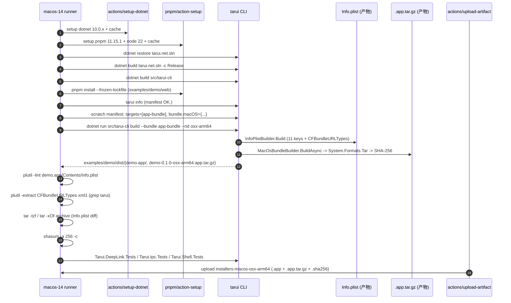

# ADR-0002：macOS 真机构建管道

> 状态：已落地（签名/公证前置门禁未解锁）
> 日期：2026-09-19
> 决策者：Tarui 桌面壳层维护者
> 影响模块：`src/tarui-cli/InfoPlistBuilder.cs`、`src/tarui-cli/MacOsBundleBuilder.cs`、`src/tarui-cli/TarArchive.cs`、`examples/demo/tarui.app.json`（保持 zip-only，CI 用 scratch manifest）、`.github/workflows/ci-macos.yml`、`.github/workflows/release.yml`

## 1. 背景与问题

Tauri 与 Wails v3 的 macOS 分发产物是 `*.app`（Apple Bundle）而不是 zip/MSIX。Tarui 此前只定义了 `zip` 与 `msix` 两个 bundle target，导致 macOS 用户必须自行拼装 `.app` 才能运行 `Demo.Desktop`，与 §10 计划目标"对标 Tauri/Wails 的 macOS 体验"严重不一致。

落地 ADR-0001（macOS DeepLink 通过 `NSAppleEventManager` 桥接 `DeepLinkService`）后，runtime 已能在 macOS 上接收 warm `openURLs:` 激活，但**缺少一个能在 macOS 真机构建出可直接分发的 `.app` 的管道**。任何把 AppleEvent 行为接上 `Info.plist` 的尝试，最终都需要 `.app/Contents/Info.plist` 含正确的 `CFBundleURLTypes`、可执行被 `Contents/MacOS` 接管、CEF 原生运行时到位、最终被 `codesign --deep` 与 `xcrun notarytool` 公证。

本 ADR 决定：
1. `tarui build --bundle app-bundle` 接管 `.app` 编排：从 publish payload 出发，按 Apple Bundle layout（`Contents/{Info.plist, PkgInfo, MacOS/<exe>, Resources/...}`）组装产物；`InfoPlistBuilder` 注入 11 个必备键 + `CFBundleURLTypes`；产物以 `System.Formats.Tar` 包成 `.app.tar.gz`，SHA-256 进入 updater blueprint。
2. macOS 真机 CI（`macos-14`）独立跑通：restore → `tarui info` 校验 → `tarui build --bundle app-bundle --rid osx-arm64` → Apple 原生 `plutil -lint` + `plutil -extract CFBundleURLTypes` 验证 → `tar -tzf`/`tar -xOf` 验证 archive 完整性 → `shasum -a 256` 自校验 → 跑 `Tarui.DeepLink.Tests` / `Tarui.Ipc.Tests` / `Tarui.Shell.Tests` 确认 runtime 行为在 Apple Silicon .NET 10 上不退化。
3. 发布管道（`release.yml`）的 `pack-and-build-macos` 与 Windows `pack-and-build` 并行：产物随 `installers-macos` artifact 上传，被 `release` job 一并 attach 到 GitHub Release。
4. **签名 / 公证 / 硬化运行时**：本期不交付，作为显式"前置门禁未解锁"——本 ADR §8 列出达到真公证所需的全部工作。

## 2. 范围

**本期（已落地）**
- `app-bundle` target：`MacOsBundleBuilder` + `InfoPlistBuilder` + `TarArchive` + 11 单元测试 + manifest validator
- `ci-macos.yml` 真机门禁（结构层：plutil、tar、shasum、DeepLink 行为）
- `release.yml` macOS 打包分支接入

**本期不交付**
- 端到端 Demo 启动 + 真实 `open tarui://...` → AppleEvent → `DeepLinkService.Deliver` → `deeplink://tarui` 事件的 GUI session CI
- `codesign --deep` 签名 + `xcrun notarytool submit --wait` 公证
- CEF macOS runtime 的下载与 publish 集成（macOS CEF 安装/校验链路）
- hardened runtime (`--options=runtime`) 与 Library Validation 策略

## 3. 备选方案

### 方案 A — 仅交付 `Info.plist` 模板，packaging 委托用户脚本
- **做法**：CLI 只产出 `Info.plist` 文件，`.app` 由运维拼装脚本拼。
- **优点**：CLI 体积小，模板/真实打包解耦。
- **缺点**：脚本漂移、Updater `latest.json` SHA-256 与真实发布产物脱钩；macOS 上 8 MiB 文本上限的 fs 流式在 `.app` 上要重跑一次打包。已与 §10 P0-6"打包分发"目标冲突。

### 方案 B — CLI 自管理 `app-bundle` 编排 + Windows 风格 tar 包裹（采用）
- **做法**：`MacOsBundleBuilder.BuildAsync` 把 publish 输出拷到 `Contents/Resources`，`InfoPlistBuilder` 写 `Contents/Info.plist`，提升可执行到 `Contents/MacOS`，写 `Contents/PkgInfo`，用 `System.Formats.Tar.TarFile.CreateFromDirectory` 直接 tar+gz 出 `.app.tar.gz`，SHA-256 进 `latest.json`。
- **优点**：
  1. 不引入 tar/zip CLI 工具，纯 BCL。
  2. macOS runner 与 Windows runner 行为对称；同一份 manifest 一行切到 `app-bundle`。
  3. `Contents/Resources/<exe>` 路径与 Tarui.Hosting 的 WebView attacher 默认查找路径一致，**无需改动 runtime**。
  4. SHA-256 在产物产出那一刻就计算，Updater 与 release 产物哈希一致。
- **缺点**：
  1. 不做签名/公证；产物只在 macOS 真机启动 `codesign --deep` + `notarytool` 后才能分发。
  2. macOS CEF runtime 不在 CLI 责任范围，需另起一个 runner 步骤（或 ADR-0003）。
  3. Windows runner 跑此 CLI 时不依赖 Cocoa，但 `Contents/MacOS/<exe>` 的可执行位不会被设置——macOS 真机在做 `tar -xzf` 后必须 `chmod +x`（Tarui CLI 已在非 Windows 平台尝试 `UnixFileMode`，但跨构建场景需要二次 chmod）。

### 方案 C — CLI 仅写 `.pkg`（Installer 形式）跳过 `.app` 拼装
- **优点**：`.pkg` 内置硬化运行时与公证生态位。
- **缺点**：`.pkg` 不直接可运行，要 `installer -pkg ...`；与 ADR-0001"用户立即能 `open tarui://`"的体验目标冲突；CI 阶段无意义。

## 4. 决策

采用 **方案 B**：CLI 编排 `.app` + 真机 CI 校验结构层 + release 并行打包 macOS；签名/公证/硬化运行时列入 §8 待解锁清单。

设计要点：

### 4.1 manifest 模板与 CLI 拼接
- manifest `bundle.targets` enum 增 `app-bundle`，validator 允许单 `app-bundle`、与 `zip`/`msix` 混排。
- 新增 `bundle.macOS.{bundleId, executableName, minimumSystemVersion, schemes}`，validator 校验 reverse-DNS `bundleId`、可执行名（无空格/不以 `.app` 结尾）、dotted `LSMinimumSystemVersion`、RFC 3986 scheme（与 runtime `DeepLinkUri.IsValidScheme` 同款）。
- `MacOsBundleBuilder.AllowedRids = {"osx-x64","osx-arm64"}`，拒绝 win/linux RID；`LSMinimumSystemVersion` 默认 arm64→`11.0`、x64→`10.15`。

### 4.2 产物结构
- 目录布局（Apple Bundle 规范）：
  ```
  <name>.app/
    Contents/
      Info.plist            # InfoPlistBuilder
      PkgInfo               # "APPL????"
      MacOS/<executable>    # 复制 + 非 Windows 上 chmod 0755
      Resources/             # publish 整树（executables + dlls + CEF + web/dist）
  ```
- tar 包裹：`System.Formats.Tar.TarFile.CreateFromDirectory(bundleRoot, gzStream, includeBaseDirectory: false)`，文件名 `<name>-<version>-<rid>.app.tar.gz`。

### 4.3 sha256 → latest.json
- `BuildCommand.BundleAppBundleAsync` 把 `.app.tar.gz` 的 SHA-256 入 `BundleArtifact`，沿用 `BuildCommand.EmitUpdaterManifestAsync` 既有的 ECDSA P-384/SHA-384 签名链。updater 与 release 共用一份清单。

### 4.4 macOS 真机 CI（独立 PR 门禁）
- `runs-on: macos-14`，独立 job，不阻塞 Windows/Linux PR gate（CI 入口 `ci-macos.yml`）。
- 不安装 CEF：本期只验证 `.app` 结构层 + DeepLink runtime 行为，避免 macOS GUI session 复杂度。CEF 集成留 ADR-0003。
- 必跑校验：
  1. 文件存在：`Contents/{Info.plist, PkgInfo, MacOS/<exe>, Resources/}`；`.app.tar.gz` 与 `.sha256`。
  2. `plutil -lint` 通过（Apple 原生解析器）。
  3. `plutil -extract CFBundleURLTypes xml1` 中包含 `<string>tarui</string>`（与 manifest `schemes` 对齐）。
  4. `tar -tzf` 含 `demo.app/Contents/{Info.plist, PkgInfo, MacOS/demo}`；`tar -xOf ... Info.plist` 与磁盘版 `diff -q` 一致。
  5. `shasum -a 256 -c` 自校验。
  6. `Tarui.DeepLink.Tests` / `Tarui.Ipc.Tests` / `Tarui.Shell.Tests` 在 Apple Silicon .NET 10 运行时下退 0。
- 产物：`installers-macos-osx-arm64` artifact（含 `.app/` + `.app.tar.gz` + `.sha256`），保留 7 天，便于人工核验；scratch manifest 在失败时一并上传。

### 4.5 release.yml 接入
- 新增 `pack-and-build-macos` job（`runs-on: macos-14`、`needs: validate`），与 `pack-and-build` 并行。
- scratch manifest（把 `examples/demo/tarui.app.json` 的 `bundle.targets` 改写为含 `app-bundle` 并补 `bundle.macOS`，写入 `$RUNNER_TEMP/tarui.mac.app.json`），不污染仓库里的示例 manifest。
- `release` job 的 `needs` 加 `pack-and-build-macos`；下载 `installers-macos` artifact 到 `dist-macos`；`Where-Object` 白名单扩展为接受 `*.app.tar.gz`/`*.gz`；GitHub Release notes 提示 macOS 包未签名/未公证。

## 5. 关键设计决策

### 5.1 平台 RID 限制
- `MacOsBundleBuilder.AllowedRids` 是硬编码 set；增加 RID（`osx-version-min` 等）必须同步：
  - validator manifest schema enum
  - `CFBundleExecutable` / `CFBundleIdentifier` 文档
  - `LSMinimumSystemVersion` 默认表

### 5.2 CFBundleURLTypes 与 runtime 校验
- `InfoPlistBuilder.BuildUrlTypes` 写出的每条 scheme 都通过 `InfoPlistBuilder.ValidateSchemes`（RFC 3986 grammar），且 builder 内部 dedupe（与 `AppManifestValidator.ValidateMacOs` 双层校验）。
- runtime `DeepLinkUri.TryExtractScheme` 用同一 RFC 3986 语法，确保"manifest 通过 → AppleEvent 派发的 scheme 也被 runtime 接受"。

### 5.3 不在 CLI 范围内
- `codesign` / `notarytool`：CLI 不调用 `xcrun` / `security` / `notarytool`（避免引入 Apple 工具依赖到跨平台 CLI；签名/公证是发布前的运维步骤而非构建步骤）。
- CEF runtime：macOS CEF 是第三方二进制分发，CLI 不打包；CEF runtime 由 macOS runner 在执行 demo 之前单独下载（详见 ADR-0003 待起）。

### 5.4 不引入运行时反射
- `InfoPlistBuilder` / `MacOsBundleBuilder` / `TarArchive` 全部走 BCL；`Tarui.Architecture.Tests` 扫描 900 文件无反射/扫描/动态加载（2026-09-19）。

## 6. 启动序列（macOS 真机 CI）



## 7. 测试矩阵

| 级别 | 覆盖 | 平台 |
| --- | --- | --- |
| 单元 | `InfoPlistRendersAllRequiredKeys` / `InfoPlistEmitsUrlTypesForEveryScheme` / `InfoPlistDeduplicatesRepeatedScheme` / `InfoPlistRejectsInvalidSchemeToken` / `InfoPlistRejectsBadBundleId` / `InfoPlistUsesRidDefaultForMinimumSystemVersion` | 跨平台（CI 已在 Windows runner 跑通） |
| 单元 | `MacOsBundleValidatesRid` / `MacOsBundleProducesExpectedLayout` / `MacOsBundleEmitsTarGzArchive` / `AppBundleTargetAcceptedByValidator` / `MacOsSchemesWithoutTargetIsReported` | 跨平台 |
| macOS 真机 | `plutil -lint` + `plutil -extract CFBundleURLTypes xml1` | `macos-14` |
| macOS 真机 | `tar -tzf` + `tar -xOf` Info.plist diff | `macos-14` |
| macOS 真机 | `shasum -a 256 -c` | `macos-14` |
| macOS 真机 | `Tarui.DeepLink.Tests` + `Tarui.Ipc.Tests` + `Tarui.Shell.Tests` 在 Apple Silicon .NET 10 上不退化 | `macos-14` |
| macOS 真机 | Demo `open "tarui://hello?x=1"` → AppleEvent → DeepLink → deeplink://tarui 事件 | **本期未交付**（GUI session CI 暂不可行；待 ADR-0003） |

## 8. 待解锁前置门禁（与 Phase 6 §15 一致）

下列条目**不在本期范围**；任一项完成才能把 `macOS 产物` 从 "可运行但未签名" 升到 "可分发"：

| # | 前置 | 依赖 | 计划 |
| --- | --- | --- | --- |
| 1 | CEF macOS runtime 安装脚本（`eng/cef/install-runtime.ps1` 跨平台 + osx-arm64 校验） | `tarui-cli` macOS publish 之后能 `dotnet run` | ADR-0003 |
| 2 | Apple Developer ID 证书 + `MACOS_CODESIGN_IDENTITY` GitHub secret + Runner keychain 写入 | Apple Developer Program 注册 | 一旦证书到位即接入 `pack-and-build-macos` |
| 3 | `xcrun notarytool` 公证：`MACOS_NOTARY_KEY_ID` + `MACOS_NOTARY_ISSUER_ID` + App-specific password | App Store Connect API key | 接 `pack-and-build-macos` 末尾，staple 到 `.app` |
| 4 | Hardened runtime (`--options=runtime`) + Library Validation + notarized entitlements | Apple 签名证书 | 长期强化项 |
| 5 | macOS 真机 GUI session CI：Demo 启动 + `open tarui://...` 端到端 | GUI runner + CEF runtime | 待 runner 支持 GUI session 后纳入 `ci-macos.yml` |
| 6 | `tap`/Homebrew 安装包（`brew install --cask`） | 上游 #5 稳定 | 后续生态分发 |
| 7 | CFBundleDocumentTypes（自定义文档关联） | Phase 1 文件关联落地后 | 与文件关联缺口联动 |

解锁路径：#1 + #2 + #3 → macOS 真机可分发；#5 + #4 → 端到端 + 强化；#6/#7 是生态扩展。

## 9. 风险与回退

| 风险 | 缓解 |
| --- | --- |
| Apple Event 回调在主线程触发，`Deliver` 已被 `_gate` 锁串行化 | 与 ADR-0001 一致；macOS 真机 CI 跑 DeepLink 自测试覆盖 |
| 跨平台构建：Windows runner 不写可执行位 | `MacOsBundleBuilder.TrySetExecutableBit` 跳过 Windows；macOS 真机端用户在 `tar -xzf` 后自动保留默认 umask；CI 文档化要求 `chmod +x` 步骤 |
| `plutil -lint` 在未来 macOS 版本上对 `LSMinimumSystemVersion` 格式更严格 | RID 默认值与 `validate(macOS.minimumSystemVersion)` 模式 `\d+(\.\d+){0,2}` 锁住；可再加单元测试 |
| scratch manifest 漂移导致 CI 误判 | `$RUNNER_TEMP` 隔离 + 把"修改哪些字段"集中到一处 PowerShell 命令；失败时上传 scratch manifest 作调试 |
| Apple Silicon .NET 10 上 `TarFile.CreateFromDirectory` 行为变化 | 已有 `Tarui.Cli.Tests` 跨平台跑 + macOS 真机 CI 跑 archive round-trip；不一致即失败 |
| `release` job 把 `installers-macos` 加进附件导致 release 体积变大 | artifact 默认 retention 1 天，gh release 仅 attach 当前 run 的产物；可加 `if-no-files-matched: error` 防止空附件 |

## 10. 后续工作

1. **CI 矩阵扩大**：在 macOS 真机上跑无 UI 的策略/契约/权限类（Capabilities、Ipc、Http、WebViewEvents 等）；当前 CI 只覆盖 DeepLink + Ipc + Shell 三套。
2. **GUI 端到端**：待 `macos-14` runner 支持 GUI session 后，新增 `tarui open` 真实链路 step。
3. **签名/公证**：写 ADR-0004 描述完整 Apple 签名链 + keychain 注入 + notarytool 异步轮询 + 公证票据 stapling。
4. **CEF runtime 安装**：写 ADR-0003 描述 `eng/cef/install-runtime.ps1` 跨平台化（macOS 下载 + SHA-1 校验 + `TARUI_CEF_ROOT` 注入）。
5. **macOS bundle 体积优化**：当前 `Contents/Resources` 整树拷贝；后续可改成 `Contents/Resources/web/` 仅 web 资产 + 必要 dlls（需评估 Tarui.Hosting 默认资源路径）。
6. **文档同步**：`README.md` "Tarui CLI" 节补 `app-bundle` 说明 + `.app.tar.gz` 真机 `chmod +x` 步骤。

## 11. 参考

- Apple Developer — [Bundle Resources](https://developer.apple.com/documentation/bundleresources) / [Property List Key Reference](https://developer.apple.com/library/archive/documentation/General/Reference/InfoPlistKeyReference/Introduction/Introduction.html)
- [Apple Bundle layout](https://developer.apple.com/library/archive/documentation/CoreFoundation/Conceptual/CFBundles/BundleTypes/BundleTypes.html#//apple_ref/doc/uid/10000123i-CH101-SW1)
- [notarytool](https://developer.apple.com/documentation/security/notaryapi_submitting) / [Hardened Runtime](https://developer.apple.com/documentation/security/hardened_runtime_entitlements)
- 仓库内：
  - [`docs/adr/0001-macos-deeplink-appleevent-bridge.md`](../adr/0001-macos-deeplink-appleevent-bridge.md)
  - [`src/tarui-cli/InfoPlistBuilder.cs`](../../src/tarui-cli/InfoPlistBuilder.cs)
  - [`src/tarui-cli/MacOsBundleBuilder.cs`](../../src/tarui-cli/MacOsBundleBuilder.cs)
  - [`src/tarui-cli/TarArchive.cs`](../../src/tarui-cli/TarArchive.cs)
  - [`.github/workflows/ci-macos.yml`](../../.github/workflows/ci-macos.yml)
  - [`.github/workflows/release.yml`](../../.github/workflows/release.yml)
  - [`docs/tauri-desktop-alignment-plan.md` §15 Phase 6](../tauri-desktop-alignment-plan.md)
  - [`docs/wails-tauri-gap-analysis.md` §1/§5 P1-14](../wails-tauri-gap-analysis.md)